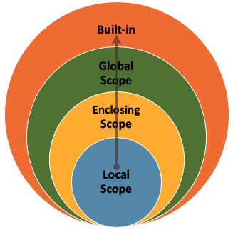

# Python Scope

## What Is Scope?

When you create a variable or define a function, it is not available everywhere in your program. **Scope** refers to the region of your code where a particular name (variable, function, etc.) can be accessed.

Python organises scope into four layers, from innermost to outermost:

| Layer | What lives here | Example |
|---|---|---|
| **Local** | Variables defined inside the current function | `y = 5` inside a function |
| **Enclosing** | Variables in a surrounding (outer) function | An outer function's variable accessed by a nested function |
| **Global** | Variables defined at the top level of a script or module | `x = 10` outside any function |
| **Built-in** | Names that Python provides automatically | `print()`, `len()`, `range()` |



### The LEGB Rule

When you use a name in your code, Python looks it up in this order:

1. **L**ocal: inside the current function.
2. **E**nclosing: in any surrounding function (for nested functions).
3. **G**lobal: at the module/script level.
4. **B**uilt-in: among Python's built-in names.

Python stops as soon as it finds a match. If no scope contains the name, you get a `NameError`.

### Local Scope

The local scope is the innermost scope, typically within a function. Variables defined inside a function are accessible only within that function.

### Enclosing Scope

When one function is defined inside another, the inner function can access variables from the outer function. Those outer-function variables live in the **enclosing** scope.

### Global Scope

The global scope is the outermost scope of your script. Variables defined at this level are accessible from anywhere in the code, including inside functions.

### Built-in Scope

This is the highest level of scope. It includes all the names that are always available when you run a Python program: the built-in functions, exceptions, and objects that are part of the language itself. You do not need to import anything to use them. We have already learned some built-in functions, such as `print()` and `len()`.

---

## `return` inside an `if` Clause

When `return` is used inside an `if` clause, the function returns a value and stops executing as soon as the condition is met.

```{python}
def check_even(number):
    if number % 2 == 0:
        return True
    return False

print(check_even(5))
print(check_even(8))
```

If `number` is even, the function returns `True` and exits immediately. If `number` is not even, it continues to the next line (`return False`) and then exits.

## `return` inside a `for` Loop

When `return` is used inside a `for` loop, the function exits as soon as `return` is reached — the remaining iterations are skipped.

```{python}
def find_element(sequence, target):
    for item in sequence:
        if item == target:
            return True
    return False

seq = [1, 2, 3, 4, 5, 6]
print(find_element(seq, 5))
print(find_element(seq, 8))
```

If the `target` is found in the `sequence`, the function returns `True` and exits the loop and the function. If the loop completes without finding the target, it returns `False`.

Using `return` inside loops and conditionals is a way to exit a function early when a specific condition is met. Design your functions carefully to make sure they return the correct value in every case.

**Example.** Write a Python function `is_prime(n)` that checks if a given number `n` is prime.

```{python}
def is_prime(number):
    # Loop through all numbers lower than `number`
    for x in range(2, number):
        if number % x == 0:
            # If the remainder is 0, then the number is not prime
            # Using return inside a loop finishes the whole function
            return False
    # If the loop finishes, the number is prime
    return True

print(is_prime(3))
```

```{python}
print(is_prime(11))
```

```{python}
print(is_prime(4))
```

---

## Local Scope in Practice

Consider the following code. The variable `x` is **global** (defined outside any function), and `print` is a **built-in** function.

```{python}
x = 10  # Global variable
print(x) # Built-in function
```

Inside a function, we can create **local** variables and also access global ones:

```{python}
def example_function():
    y = 5      # Local variable
    z = 2 * x  # Accessing the global variable `x`
    print(y)   # Accessing the local variable
```

```{python}
example_function()
```

However, a local variable does not exist outside its function:

```{python}
# Trying to access `y` here fails because we are outside the function
print(y)
```

**Example.** Before running the code below, think about what you expect to happen with the variable `x` when we call the `modify_variable` function. Will its value change? Why or why not?

```{python}
x = 5


def modify_variable(y):
    x = 10
    return y + x


result = modify_variable(7)
print(result)
```

There are two variables named `x`. The global `x` is set to `5`, while the `x` inside `modify_variable` is set to `10`. When we call `modify_variable(7)`, it returns `7 + 10`, which is `17`. The global `x` is unchanged.

### Variable Shadowing

**Variable shadowing** happens when a function defines a variable with the same name as a variable in the global scope. In the example above, the local `x` *shadows* the global `x`.

Variable shadowing is not necessarily problematic, but it is better practice to use unique variable names to avoid confusion.

---

## Function and Variable Names

Be careful with variable and function names! Using a function name as a variable will overwrite it.

```{python}
# Define `square_root` as a function
def square_root(x):
    return x ** (1 / 2)
```

```{python}
square_root = square_root(16)
# Now `square_root` refers to the number 4.0
# We have lost our `square_root` function!
```

```{python}
# What happens when we try to call the function now?
print(square_root(9))
```
