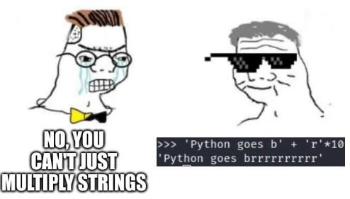

# Fundamentals: Strings in Python

Strings are used to store and manipulate text. As you see here, strings are written inside of quotes and can contain letters, numbers, punctuation marks, and other special characters. A string is contained within two quotes `"` or single quotes `'`.

Run the following cells to print these four different strings.

```{python}
text_only = "This string is only text"
print(text_only)
```

```{python}
text_with_special_chars = "This -string- has $pecial characters..."
print(text_with_special_chars)
```

```{python}
emoji_string = "¯\_(ツ)_/¯"
print(emoji_string)
```

```{python}
number_string = "2.99"
print(number_string)
```

If you use triple quotation marks, you can store a **multiline string**. These strings can span more than one line. When you run the following cell, you will see how the spaces in the second line are actually read as characters for the string.

```{python}
long_string = """This is a long string
      that spans multiple lines."""
print(long_string)
```

::: {.callout-note}
## Exercise

Fix this code.

```{python}
#| eval: false
long_string = "Why is this
      not working?!"
print(long_string)
```

:::

::: {.callout-tip collapse="true"}
## Solution

The code fails because a normal string cannot continue onto the next line without being closed first.

```{python}
long_string = """Why is this
      not working?!"""
print(long_string)
```

:::

---

## Mixing strings with computations or data: f-Strings

In Python, you can utilize f-strings, which stand for formatted string literals. These allow you to seamlessly insert expressions into string literals by enclosing them with curly braces `{}` and adding an 'f' prefix to the string. F-strings offer an easily readable method for string formatting as they calculate expressions and incorporate their results directly into the string.

```{python}
message = f"Louis is {23} years old."
print(message)
```

::: {.callout-note}
## Exercise

In a new cell, enter your favorite number and store it in a variable called `fav_num`. Print out a message telling you what your favorite number is.

:::

::: {.callout-tip collapse="true"}
## Solution

```{python}
fav_num = 42
print(f"My favorite number is {fav_num}.")
```

:::

We can perform arithmetic operations inside f-strings.

```{python}
message = f"Louis is {23 / 7} dog years old."
print(message)
```

We can avoid decimals by specifying the format of the number.

```{python}
message = f"Louis is {23 / 7:.0f} dog years old."
print(message)
```

In `f"{23 / 7:.0f}"`, the `:.0f` part tells Python to display the result of `23 / 7` without any decimal places. The `f` in `:.0f` indicates that the number is a floating-point number and should be formatted accordingly. This means it will be rounded to the nearest whole number and displayed without any decimal part.

::: {.callout-note}
## Exercise

Write a code that prints the message "NAME is X dog years old." where NAME is a person's name and X is the result of dividing their age by 7. Format the result to display no decimal places.

```{python}
name = "Michael"
age = 54
```

:::

::: {.callout-tip collapse="true"}
## Solution

```{python}
print(f"{name} is {age / 7:.0f} dog years old.")
```

Remember: a variable stores the most updated score value. See what happens when we reassign the variable `name`. Run the cell bellow and then re-run the cell above you!

```{python}
name = "Tina"
```

:::

::: {.callout-note}
## Exercise

Compute a cubic root inside a f-string and display the result with three decimal digits.


:::

::: {.callout-tip collapse="true"}
## Solution

```{python}
message = f"The cubic root of 23 is {23 ** (1/3):.3f}."
print(message)
```

:::

::: {.callout-note}
## Exercise

Fix the following line of code.


```{python}
#| eval: false
print(f"There are {365/7 weeks in a year")
```

:::

::: {.callout-tip collapse="true"}
## Solution

The f-string is missing the closing brace for the expression and the closing quote for the string.

```{python}
print(f"There are {365 / 7:.2f} weeks in a year")
```

:::

::: {.callout-note}
## Exercise

Complete this line of code.

```{python}
#| eval: false
print(f"The area of a square with side 5 cm is {} cm squared.")
```

:::

::: {.callout-tip collapse="true"}
## Solution

```{python}
print(f"The area of a square with side 5 cm is {5 ** 2} cm squared.")
```

:::

::: {.callout-note}
## Exercise

Complete the code below to perform this Math's "party trick":

- Pick a number between 20 and 100.
- Now add your digits together.
- Now subtract the total from your original number.
- Finally, add the digits of the new number together.
- Your answer will always be 9

```{python}
#| eval: false
my_number =
print(f"Now add your digits together: {}")
print(f"Now subtract the total from your original number: {}")
print(f"Finally, add the digits of the new number together: {}")
print("Your answer is 9.")
```

:::

::: {.callout-tip collapse="true"}
## Solution

```{python}
my_number = 42
digit_sum = 4 + 2
new_number = my_number - digit_sum
final_sum = (new_number // 10) + (new_number % 10)

print(f"Now add your digits together: {digit_sum}")
print(f"Now subtract the total from your original number: {new_number}")
print(f"Finally, add the digits of the new number together: {final_sum}")
print("Your answer is 9.")
```

:::

---

## Operations with Strings

We can concatenate or combine strings by using the addition symbols `+`, and the result is a new string that is a combination of both:

```{python}
s = "Hello"
w = "World"

print(s + w)
```

How would we form the sentence "Hello World", including the space?

```{python}
s = "Hello"
w = "World"

print(s + " " + w)
```

However, you cannot concatenate strings and numbers.

```{python}
print(2 + "3")
```

However, we can multiply strings and whole numbers! This will replicate the string




```{python}
print(4 * "Hello")
```

::: {.callout-note}
## Exercise

Replicate the word "Hello" leaving a space between each word.


:::

::: {.callout-tip collapse="true"}
## Solution

```{python}
s = "Hello"
print(4 * (s + " "))
```

:::

---

## String Methods

Strings are not just simple variables, they are **objects**. Objects in Python come with built-in functions, called **methods**. We can think of methods as special tools that objects have, and these tools allow us to perform various operations on strings, such as manipulating, searching, or formatting text. We are going to use some basic string methods.

#### Case Conversion

Let's try the method `s.upper()`, that returns a **copy** of `s` with all alphabetic characters converted to uppercase.

A "copy" means that the original variable remains the same.

```{python}
s_old = "hello"  # original variable
s_new = s.upper()  # new variable

print(s_old)  # original variable remains unchanged
print(s_new)  # new variable created with `upper`
```

Here are some other methods for case conversion. All methods return a copy of the original string.

```{python}
s = "Hello world"

print(s.lower())  # Turns all characters to lower case
print(s.capitalize())  # Turns uppercase the first letter only
print(s.swapcase())  # Swaps lowercase with uppercase and viceversa
print(s.title())
```

#### Find and Replace

These methods offer different ways to search for a specified substring within the target string.

Some methods require us to input **arguments**. For instance, the method `s.replace(<old>, <new>)` takes two arguments, `<old>` and `<new>`. This method replaces a segment of the string, i.e. a substring with a new string.
- The first argument `<old>` defines the part of the string we would like to change.
- The second argument `<new>` is what we would like to exchange the `<old>` segment with.

The result is a new string with the segment changed:

```{python}
s_old = "Hello world"
s_new = s_old.replace("world", "amigo")

print(s_new)
```

If the optional `<count>` argument is specified, in the form of  `s.replace(<old>, <new>, <count>)` a maximum of `<count>` replacements are performed, starting at the left end of `s`.

```{python}
s_old = "foo bar foo baz foo qux"
s_new = s_old.replace("foo", "grault", 2)

print(s_new)
```

The method `s.count(<sub>)`  returns the number of non-overlapping occurrences of substring `<sub>`.

```{python}
s = "pizza pizza pizza"
n = s.count("pizza")

print(n)
```

The method `s.startswith(<sub)>` returns `True` if our string starts with the specified `<sub>` and `False` otherwise.

```{python}
s = "football"
s_starts = s.startswith("foot")
s_ends = s.endswith("ball")

print(s_starts)
print(s_ends)
```

The method `s.find(<sub>)` finds a sub-string `<sub>`. The argument is the substring you would like to find, and the output is the first index of the sequence.

```{python}
s = "I am Daniel and I am your teacher"
index = s.find("am")

print(index)
```

```{python}
s = "I am Daniel and I am your teacher"
index = s.find("am")

print(s[index])
```

If the sub-string is not in the string then the output is a negative one.

```{python}
s = "Hello world"
index = s.find("Waldo")

print(index)
```

`s.rfind(<sub>)` returns the highest index in `s` where substring `<sub>` is found.

```{python}
s = "I am Daniel and I am your teacher"
index = s.rfind("am")

print(index)
```

#### Character Classification

Methods within this category classify a string according to its character composition.

`s.isalnum()` returns a Boolean value, `True`, if `s` is not empty and comprises solely alphanumeric characters (which can be either letters or numbers); otherwise, it returns `False`.

```{python}
s = "hello123"
b = s.isalnum()

print(b)
```

`s.isalpha()` returns a Boolean value, `True`, if `s` is not empty and consists entirely of alphabetic characters; otherwise, it returns `False`.

`s.isdigit()` returns a Boolean value, `True`, if `s` is not empty and consists entirely of numeric digits; otherwise, it returns `False`.

### String Formatting

The methods in this category are used to alter or improve the formatting of a string.

The `s.center(<width>, <fill>)` method generates a string where the content of `s` is centered within a field of specified total width `<width>`. The `<fill>` argument is optional, and if provided, it's used as the padding character.

```{python}
s = "hello"
s_centered = s.center(10, "-")

print(s_centered)
```

The `s.strip()` method removes any leading and trailing whitespace characters from a string.

```{python}
w = " hey you "
w_stripped = w.strip()

print(w_stripped)
```

We can use the optional argument `<chars>` in the form `s.strip(<chars>)`. This argument should be a string that specifies the set of characters to be removed from the leading and trailing ends of the string `s`.

```{python}
s = "eeeeeeh Macarena"

print(s.strip("e"))
```

Alternatively, we can use `s.lstrip()` to remove leading whitespaces or `s.rstrip()` to remove trailing whitespaces from the string `s`.

```{python}
w = "  hola amigos  "

print(w.lstrip())
print(w.rstrip())
```

Finally, the method `split(<sep>)` returns a **list** of the substrings in the string, using `<sep>` as the separator value.

```{python}
s = "How are you doing today?"
ls = s.split(" ")

print(ls)
```

_What is a list? We will learn about them later in the course. List are sequences, just like strings, meaning we can index them._

```{python}
s = "How are you doing today?"
ls = s.split(" ")

print(ls[1])
```

#### Chaining Methods

Methods can be chained one after the other!

What would this do?

```{python}
s = "cHaNgE Me"

print(s.lower().upper())
```

```{python}
s = "This statement is false."

print(s.upper().replace("false", "true"))
```

```{python}
s = "This statement is false."

print(s.replace("false", "true").upper())
```

Too many methods?!


Don't worry, you won't need to memorize them all - AI and Google have you covered!

---
