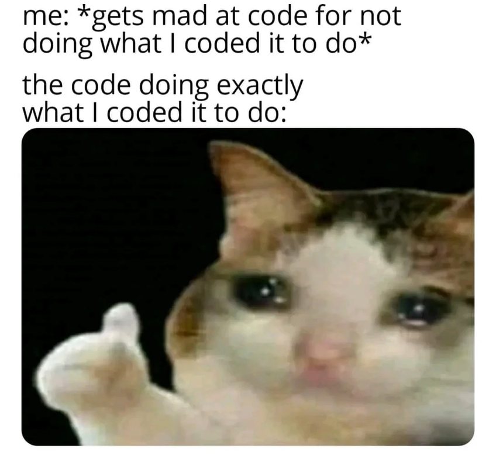

# Fundamentals: Getting Started with Python

## Hello, World!

Below is the code for the "Hello, World!", your very first line in Python!

To run the code, click anywhere into the cell (the box with the code inside), and then type `Shift` + `Enter` (`Shift` + `Return` on a Mac) to execute.

```{python}
print("Hello, world!")
```

The `print()` function is how our machine comunicates with us. Anything inside the parenthesis will be shown to the user.

Let's create python code to say hello to you, instead of the world.

```{python}
# My name is Daniel
print("Hello, Daniel!")
```

::: {.callout-note}
## Exercise

Write the code that displays your favourite food.


:::

::: {.callout-tip collapse="true"}
## Solution

```{python}
print("Pizza")
```

:::

## Comments in the Code

You may be wondering what the text is in the cells above that starts with the `#` hash or pound symbol. This is a comment line. It tells Python that it can ignore anything that follows on that line after the `#` symbol. Comments are used to help other humans understand what your code does.

Try running the next cell by pressing `Shift`+`Enter`. What do you think will happen?

```{python}
# This is a comment - Python will ignore this line
print("Hello, world!")  # This is also a comment
# And this is another comment
```

You can have multiple comment lines in your code, including one after another, and dispersed throughout your code:

```{python}
# This is an example of code with multiple
# comments, including this one which
# spans multiple lines
print("Hello, BAM!")
# Follow up with an additional print command
print("How is your first day going?")
```

It is good practice to include comments to make your code more understandable for yourself and others.

---

## Debugging

It is normal to make mistakes!

When the code is not properly written, it will raise errors. You should read the error carefully to understand what is causing it.

**Debugging** is the process of identifying and fixing errors in our code.



::: {.callout-note}
## Exercise

Fix the following lines of code.

Copy each example into your own notebook first and run it there before opening the solution. You can use the "copy" button at the right side of the code to copy the full block.

```{python}
#| eval: false
print("Hello, world!)
```

```{python}
#| eval: false
print("Hello, world!"
```

:::

::: {.callout-tip collapse="true"}
## Solution

The first line fails because the closing quote is missing. The second line fails because the closing parenthesis is missing.

```{python}
print("Hello, world!")
```

:::

---

## Arithmetic Operations in Python

We can use Python as a calculator.

```{python}
print(5 + 8 + 3)
```

Note that the extra spaces are added to make the code more readable.
`5 + 8 + 3` works just as well as `5+8+3`. And it is considered good style. Use the extra spaces in all your Notebooks.

Below are all the possible arithmetic operations you can do:

```{python}
# Sum
print(5 + 2)
```

```{python}
# Subtraction
print(5 - 2)
```

```{python}
# Multiplication
print(5 * 2)
```

```{python}
# Division
print(5 / 2)
```

```{python}
# Exponentiation
print(5 ** 2)
```

```{python}
# Quotient
print(5 // 2)
```

```{python}
# Remainder
print(5 % 2)
```

::: {.callout-note}
## Exercise

You store 10K euros in a bank account. Compute the compound interest after 10 years at a rate of 5%.


:::

::: {.callout-tip collapse="true"}
## Solution

```{python}
print(10000 * (1 + 0.05) ** 10)
```

:::

The **order of operations** in Python is the same as in arithmetic. First, you compute parentheses, then exponents, then you multiply and divide (from left to right), and finally, you add and subtract (from left to right).

::: {.callout-note}
## Exercise

Convert 32 degrees Celsius into Farenheit.

$$(F - 32) \cdot 5/9 = C$$


:::

::: {.callout-tip collapse="true"}
## Solution

```{python}
print(32 * 9 / 5 + 32)
```

:::

::: {.callout-note}
## Exercise

Fix this code to compute a square root.


```{python}
#| eval: false
print(4 ** 1/2)
```

:::

::: {.callout-tip collapse="true"}
## Solution

The code runs, but it computes $(4^1)/2$ because exponentiation happens before division. You need parentheses around the exponent.

```{python}
print(4 ** (1/2))
```

:::

---

## Variables in Python

In computer programming, **variables** are used to store, process, and manipulate data.

Let's say we want to store `4` in the variable `x`, and `9` in the variable `y`. This is what we would do:

```{python}
x = 4
y = 9
```

Both `x` and `y` are now variables. When we print a variable, we will see the value that is stored in it.

```{python}
print(x)
```

We can perform arithmetic operations with variables as well. Take a look at the following example:
$$y = f(x) = a \cdot x + b$$
with $$\begin{cases} a=2 \\ b=3 \end{cases}$$
We want to know the value of $y$ when $x = 4$, i.e. $f(4)$.

_We use $f(x)$ to better understand what parameters are used._

```{python}
a = 2
b = 3
x = 4

y = a * x + b

print(y)
```

However, in order to operate with variables, we need to make sure that they are defined first. If we try to use a variable that has not been defined, we will get an error.

```{python}
#| eval: false
q = 8
p = q * t  # Will fail because t is not defined

print(p)
```

If you are working on a notebook, Python will keep in memory the variables you have defined in previous cells. This means that you can use them in later cells without having to redefine them.

```{python}
# This print will work if you have defined x in a previous cell
print(x)
```

::: {.callout-note}
## Exercise

Given `x = 1/2`, compute:

$$y = \sqrt{\frac{3x - 1}{x^3}}$$


:::

::: {.callout-tip collapse="true"}
## Solution

```{python}
x = 0.5
y = ((3 * x - 1) / x ** 3) ** (1/2)
print(y)
```

:::

---

# Need Help?

If you have any questions, feel free to reach out via email at [dprecioso@faculty.ie.edu](mailto:dprecioso@faculty.ie.edu)

I'm happy to help!

You can also explore the custom GPT I created for this course:  
👉 [**Python IE Tutor**](https://chatgpt.com/g/g-68b05fdecaa08191b5432ca9b34d40a0-python-ie-tutor)

It's tailored specifically to support your learning throughout the course.


---
