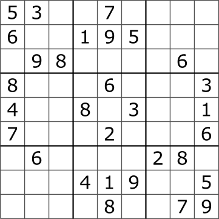

Build a solver for standard 9 × 9 Sudoku puzzles. Each row, each column, and each of the nine 3 × 3 boxes must contain the digits 1 to 9 exactly once.

Main concepts: nested lists, updating lists in place, recursion, and backtracking. The recursive step is the main challenge, so take time to trace it on paper.

<p align="center">

</p>

## Representing the board

Use a list of nine lists, each containing nine integers. A zero represents an empty cell. Row and column indices run from 0 to 8.

```{python}
board = [
    [5, 3, 0, 0, 7, 0, 0, 0, 0],
    [6, 0, 0, 1, 9, 5, 0, 0, 0],
    [0, 9, 8, 0, 0, 0, 0, 6, 0],
    [8, 0, 0, 0, 6, 0, 0, 0, 3],
    [4, 0, 0, 8, 0, 3, 0, 0, 1],
    [7, 0, 0, 0, 2, 0, 0, 0, 6],
    [0, 6, 0, 0, 0, 0, 2, 8, 0],
    [0, 0, 0, 4, 1, 9, 0, 0, 5],
    [0, 0, 0, 0, 8, 0, 0, 7, 9]
]
```

For the required steps, assume the board has the correct shape, contains only integers from 0 to 9, and has no conflicting starting clues. It may still have no solution. Your solver should find one solution if one exists; it does not need to determine whether that solution is unique.

Your solver will change the board in place. For example, `board[row][col] = num` fills a cell, and assigning zero empties it again. The original nonzero clues must remain unchanged.

## What is backtracking?

Backtracking builds a solution one choice at a time. If a choice eventually leads to a contradiction, undo it and try another option. It avoids exploring further choices once the current partial solution breaks a rule.

For Sudoku, you will choose an empty cell, try a permitted digit, and attempt to solve the remaining board. A locally permitted digit is not necessarily part of a complete solution. If the remaining board cannot be solved, erase that digit and try the next one.

## Step 1: Find an empty cell

Create `find_empty_cell(board)`.

1. Scan rows from top to bottom and columns from left to right.
2. Return `(row, col)` for the first cell containing zero.
3. Return `None` if there are no empty cells.

For the supplied board, the result should be `(0, 2)`.

Check whether the result is `None` before unpacking it into two variables. A completed board has no coordinates to unpack.

```{python}
#| eval: false

```

## Step 2: Check a possible placement

Create `is_valid(board, row, col, num)`. Assume the target cell is empty and `num` is an integer from 1 to 9.

Return `True` only if `num` is absent from:

- The target row.
- The target column.
- The target 3 × 3 box.

Otherwise, return `False`. This function checks a placement without changing the board.

Hint: the top-left corner of the relevant box is at row `(row // 3) * 3` and column `(col // 3) * 3`.

Use a fresh copy of the supplied board for these checks:

```python
is_valid(board, 0, 2, 5)  # False: row 0 already contains 5.
is_valid(board, 0, 2, 8)  # False: column 2 already contains 8.
is_valid(board, 1, 2, 3)  # False: the top-left box already contains 3.
is_valid(board, 0, 2, 1)  # True: 1 is absent from the row, column, and box.
```

The final result means that 1 is allowed at this stage. It does not guarantee that the puzzle can be completed with 1 in that cell.

```{python}
#| eval: false

```

## Step 3: Solve the puzzle with backtracking

Create `solve_sudoku(board)` using your two helper functions.

- If a solution exists, fill the board in place and return `True`.
- If no solution exists, return `False` and undo all placements made during the search, leaving the board as it was before the call.
- Keep printing outside this function so recursive calls do not print repeated results.

Try designing the algorithm yourself first. Use the guide below if you need help.

### Base case

Find the next empty cell. If there is none, return `True`. Under our assumption that the starting clues are valid, all cells have now been filled through permitted placements.

### Recursive case

If an empty cell exists:

1. Try each digit from 1 to 9.
2. If `is_valid` allows the digit, place it in the cell.
3. Call `solve_sudoku(board)` recursively to attempt the rest of the puzzle.
4. If that call returns `True`, return `True` immediately, keeping the completed board.
5. Otherwise, reset the cell to zero before trying another digit.
6. If no digit leads to a solution, return `False`.

Every recursive call works on the same board. Resetting unsuccessful placements is what allows earlier calls to try another choice.

```{python}
#| eval: false

```

## Step 4: Test and display your solution

Save a copy of the original board before solving it:

```python
original_board = [row[:] for row in board]
```

Copy each row separately. `board.copy()` alone creates a new outer list but still shares the row lists.

Call your solver, then print the completed board one row per line if it succeeds. Otherwise, display a message explaining that no solution was found.

Check that:

- Each row, column, and 3 × 3 box contains exactly the digits 1 to 9.
- Every original nonzero clue remains unchanged.
- A completed valid board is accepted without changes.
- A board with one empty cell is completed correctly.

Also test a board with no solution. To make one from a fresh copy of the supplied starting board, set `board[0][2] = 1`. This introduces no immediate duplicate, but the puzzle cannot be completed. Check that the solver returns `False` and restores the board to its state just before the call, including this added clue.

Recreate or copy your starting board before each test so earlier runs do not change later test inputs.

```{python}
#| eval: false

```

## Stretch goals (optional)

- Validate the starting board and reject invalid dimensions, values, or conflicting clues.
- Count how many attempted placements your solver makes.
- Instead of choosing the first empty cell, choose one with the fewest permitted digits. Compare the number of attempts on the same puzzle.

## Before you submit

Upload your completed notebook to the **Side Projects** section on Blackboard **before the final exam**.

Include your functions, the solved board, tests with saved outputs, and a short explanation of how resetting a cell enables backtracking. Follow the notebook and AI-use guidance on the [Side Projects page](side_projects.qmd).
